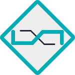
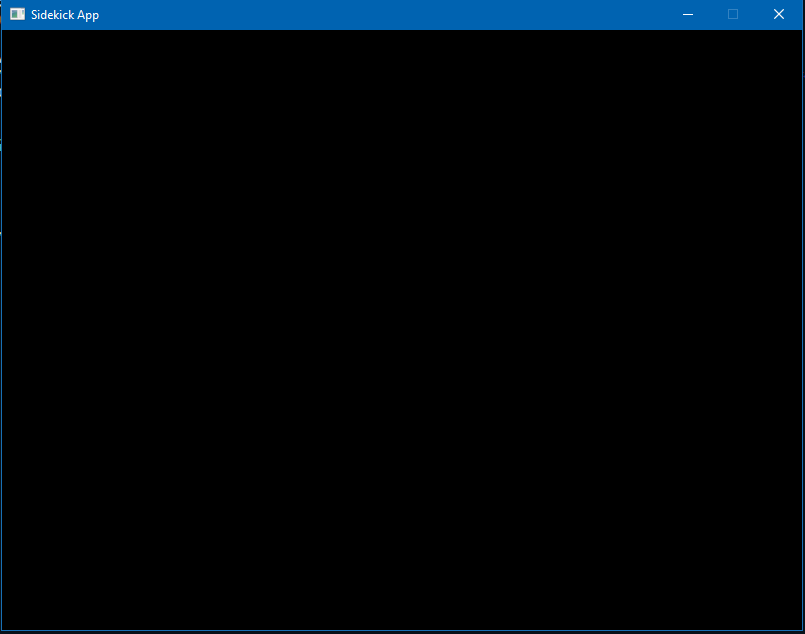

# sidekick



2D Vulkan game framework, written entirely in Rust.

---

### Table of Contents
- [About](#about)
- [Features](#features)
- [Contributing](#contributing)
- [Requirements](#requirements)
- [Getting Started](#getting-started)
- [Tutorials and Documentation](#tutorials-and-documentation)

---

### About

**sidekick** is a free and open-source game framework under the [MIT license](LICENSE) that will allow developers to create stunning 2D video games, desktop apps and everything in between. It uses [glutin](https://github.com/rust-windowing/glutin) for window context management and Vulkan as the rendering backend (the Vulkan side is not yet implemented).

**sidekick** supports Windows, Linux and macOS (although untested properly on macOS).

**sidekick** is subject to change as it is actively developed so expect things to break every now and then (sorry about that 😅).

**sidekick** is an education project for learning purposes, feel free to use it in personal and commercial projects, just keep in mind that support is minimal.

---

### Features

#### Current features
- Window Management
- Cursor Management
- Keyboard Input Handling.
- Mouse Input Handling.
- Debugging Tools.

#### Planned features
- Custom Math Library.
- Gamepad Input Handling.
- Test Framework.
- Basic Shapes Rendering (Line, Triangle, Square).
- Text Rendering.
- Sprite Rendering.
- Audio Playing.
- 2D Physics.
- 2D Lighting & Shadow.
- And more to be added...

---

### Contributing

**sidekick** is completely open to community contribution. Any effort to help expand the scope and capability of the framework is greatly appreciated 🤗.

Please make sure that you follow [the Rust API Guidelines](https://rust-lang.github.io/api-guidelines/) when making a pull request, just to make the codebase clear and consistent 😊.

---

### Requirements

- Rust compiler and Cargo package manager, you can download them [here](https://www.rust-lang.org/).
- A code editor of your choice.

---

### Getting Started

To create a basic sidekick app:

1. Create a new project with Cargo by typing `cargo new project-name --bin`.

2. In your `Cargo.toml`, add:

```rust
        [dependencies]
        sidekick = { git = "https://github.com/ThaiDuongVu/sidekick" }
```

3. In your `main.rs`, add:
```rust
        use sidekick::app::App;

        fn main() {
            let app = App::new();
            app.run(None, None, None, None);
        }
```

4. Build and run the project with `cargo run`.

5. You should see the following window by default: 


---

### Tutorials and Documentation

You can refer to the [wiki page](https://github.com/ThaiDuongVu/sidekick/wiki) (whenever it's live 🤷‍♂️) for an in-depth guide to **sidekick**.
